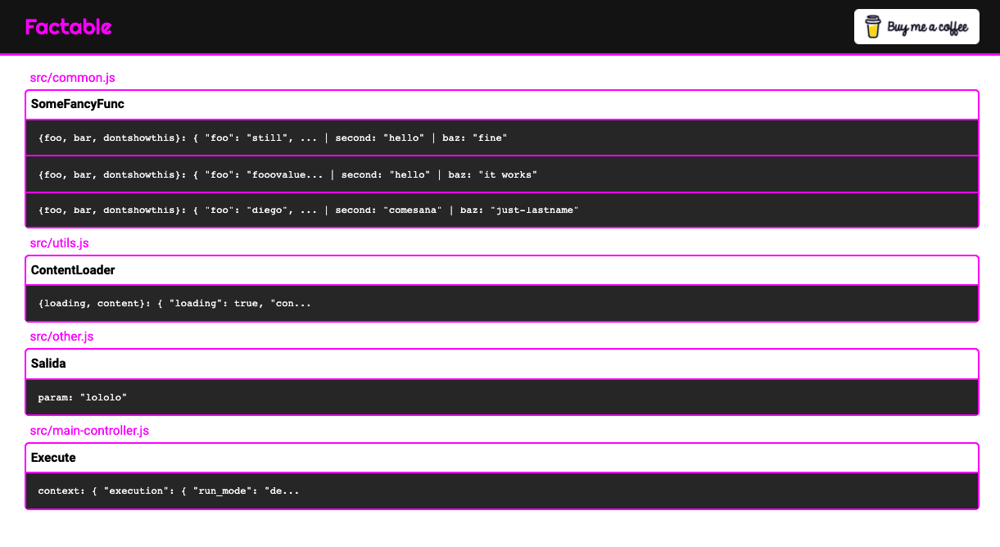
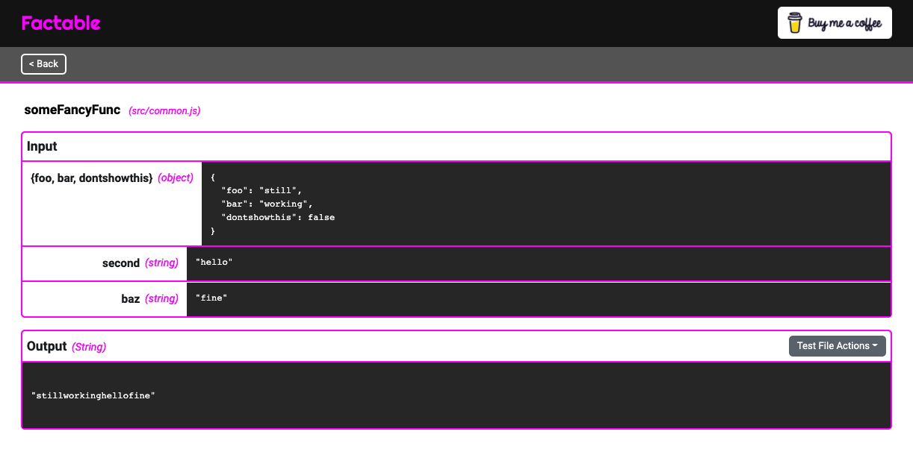
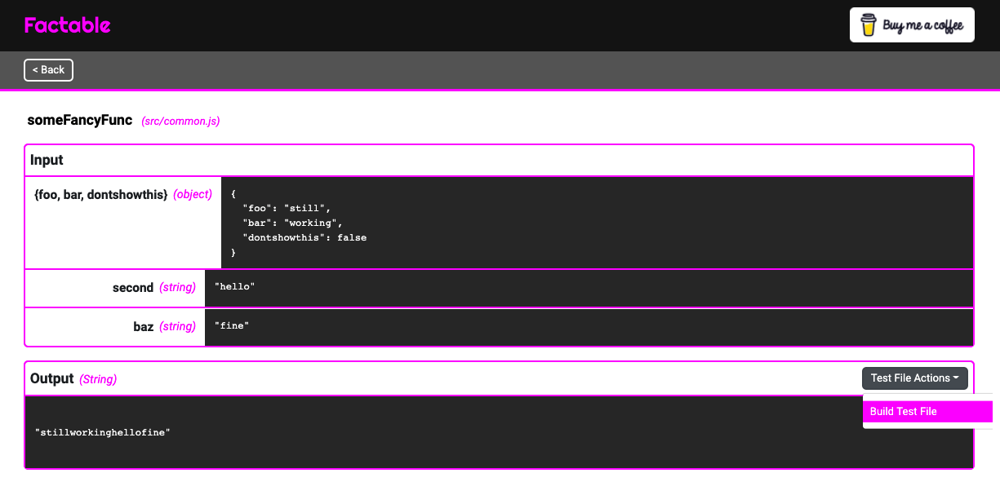
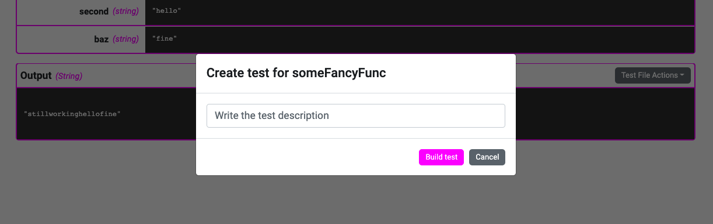
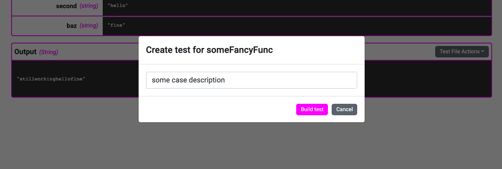
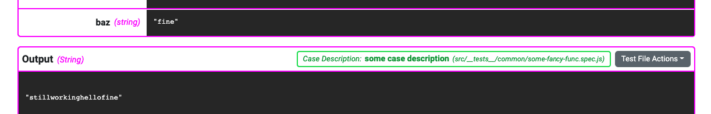
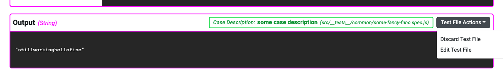
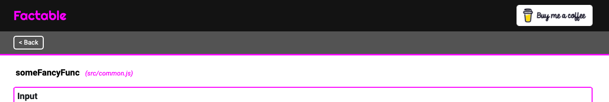
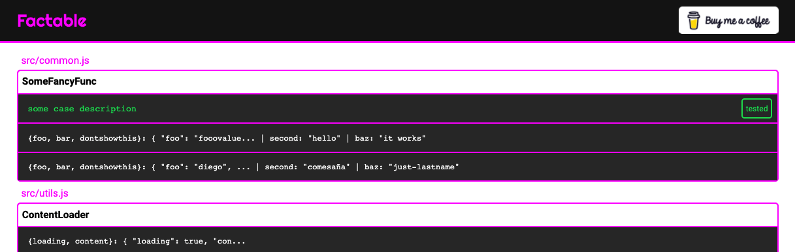
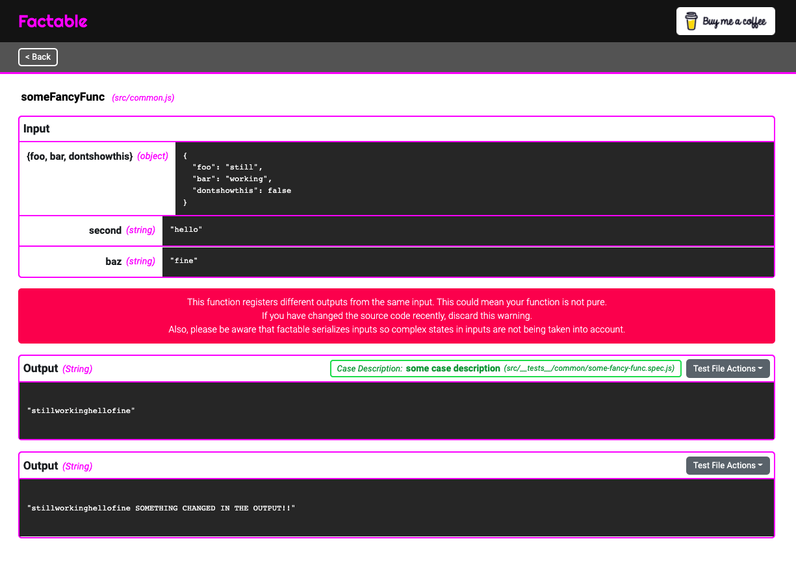

# **Factable UI** Usage

This is should create this test file:

<pre lang="js">
const { someFancyFunc } = require("../../common");

describe("someFancyFunc", () => {
  test("some case description", (done) => {
    const { foo, bar, dontshowthis } = {
      foo: "still",
      bar: "working",
      dontshowthis: false,
    };
    const second = "hello";
    const baz = "fine";
    const expectedOutput = "stillworkinghellofine";
    const output = someFancyFunc({ foo, bar, dontshowthis }, second)(baz);
    expect(output).toEqual(expectedOutput);
    done();
  });
});
</pre>
